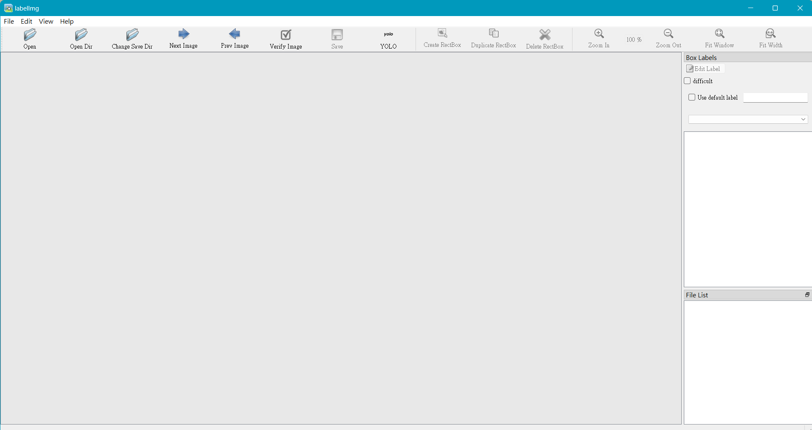
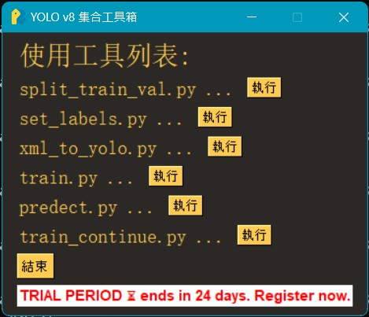

# Yolov8-simple-training-manual | Yolov8簡易訓練手冊
## Description | 介紹
設計 All in one 整合程式，在 \yolov8 底下執行 python all_in_one.py，藉由此單一程式可以完成所有訓練的工作。並結合攝像頭測試結果。

## Table of Contents | 目錄
- [Preparatory work | 事前準備工作](#Preparatory-work-|-事前準備工作)
- [Training process | 訓練過程](#Training-process-|-訓練過程)
- [Testing phase | 測試階段](#Testing-phase-|-測試階段)
- [Precautions | 注意事項](#Precautions-|-注意事項)
## Preparatory work | 事前準備工作
- 建立高效率跑模型環境
    - 使用nvidia cuda 來跑模型訓練 (相關操作可以參考 [**CUDA安裝及環境設定教學**](https://github.com/pp657783/ResNet_Example))。
- 將所有的程式包 clone 到 local 端的電腦上
- 將欲訓練的圖檔 copy 到 \yolov8\dataSets\images 目錄底下
- 標籤照片物品使用 LabelImg 軟體，**注意 python 要使用 3.10 版以下的**
    - 先在 Anaconda Powershell Prompt 上 pip install labelImg。
    - 執行 labelImg 進入程式畫面 (相關操作可以參考 [**labelImg 的祈佑小教室**](https://hackmd.io/@zxcasd89525/Syw8BypDi))。
    
- 將已標簽完成的 .txt 檔(yolo label bndBox 格式)，或是 .xml 檔(PASCAL VOC 格式) Copy 到 \yolov8\dataSets\Annotations 目錄底下
## Training process | 訓練過程
- **all_in_one.py** 首先執行程式，由上往下依序點選執行

- **split_train_val.py** 分配 train、validation、test 的測試資料比例
    - 在 \yolov8 目錄底下，執行 python split_train_val.py
    - 預設比例為 train: 70%、validation: 30%、test: 0%
- **set_labels.py** 定義 labels 的名稱，如果之前已經執行過且 labels 的內容不變，可以跳過此一步驟。
    - 在 \yolov8 目錄底下，執行 python set_labels.py
    - 在終端機螢幕上會要求輸入 labels 的內容，請依序輸入。
    - 例如 labels 為 0: dog 及 1: cat，則輸入 'dog','cat'
    - 執行完後，程式將會更改 \yolov8\data\key.ymal 及 \yolov8\xml_to_yolo.py 兩個檔案的設定
- **xml_to_yolo.py** 資料轉成 yolo 訓練格式
    - 在 \yolov8 目錄底下，執行 python xml_to_yolo.py
    - 執行完後，程式將在 \yolov8\dataSets 目錄底下新增 ImageSets、labels、path 三個新目錄。
- **train.py** 開始訓練
    - 在 \yolov8 目錄底下，執行 python train.py
    - 可選擇epochs為50、100、150、200、250、300
    - 程式將跳出視窗，要求選擇欲訓練的模型。
    - 在 \yolov8\models 目錄底下有 yolo v8 的不同模型可供選擇
    - 如要以 yolov8n.pt 來訓練，則可以點選 yolov8n.pt。
    - 接著，電腦開始依據指定的訓練圖片及訓練模型進行訓練。
- 完成訓練
    - 完成訓練後，電腦會在 \yolov8\runs\detect 目錄底下新產生 trainX 的目錄。
    - 在 trainX\weights 目錄底下，可發現 best.pt 檔案，該檔案即為訓練出來的模型檔。
- **predect.py** 執行偵測
    - 將欲進行偵測的圖檔、影片檔Copy到 \yolov8\predect 底下。
    - 在 \yolov8 目錄底下，執行 python predect.py。
    - 程式將要求選擇欲使用哪一個模型檔來進行偵測
    - 我們可以選擇之前已訓練好的模型 best.py 來對 \yolov8\predect 底下的內容偵測。
    - 程式將新產生一個 predectX 目錄在 \yolov8\runs\detect 底下，偵測結果則輸出到此目錄以下。
- **train_continue.py** 接續訓練
    - yolo 在進行訓練時，每完成一個epoch就會產生一個暫存檔。
    - 如果在訓練的過程中被中斷，可以於事後再接續先前的訓練，而毋需重新訓練。
    - 在 \yolov8 目錄底下，執行 python train_continue.py。
    - 程式將要求選擇接續哪一個訓練檔？
    - 可在 \yolov8\runs\detect\trainX\weights last.pt 檔，此為前次學習的最終狀態，相關的係數皆存放在此檔案中。
    - 選擇完後，yolo 則接續前 epoch 往下學習。
## Testing phase | 測試階段
- 在本機端執行，使用 jupyter notebook 開啟 Detect objects.py，將已訓練完的 best.pt 加載模型
- 鏡頭開始連續偵測畫面中物體
  [**草莓麵包Yolov8訓練影片**](https://youtu.be/WL8N8DOD-e4))
## Precautions | 注意事項
由於 github 有上傳資料的上限，所以 yolo v8 的官方模型，請依據個人需求至底下鏈結下載合適的模型至 \yolov8\models 目錄。
https://docs.ultralytics.com/models/yolov8/#supported-tasks-and-modes
